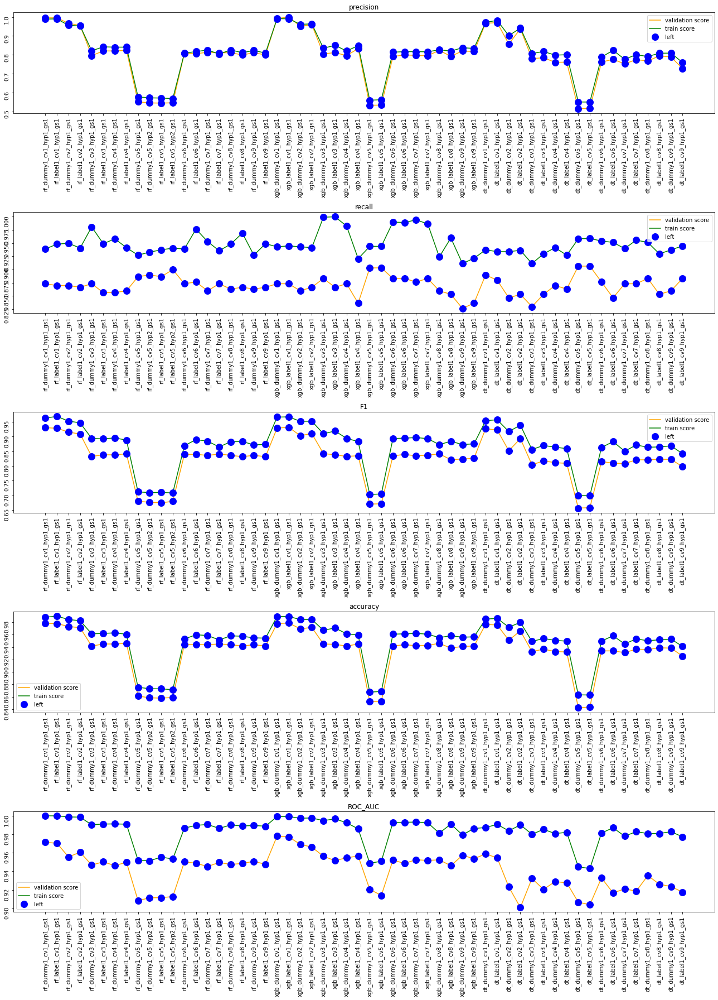
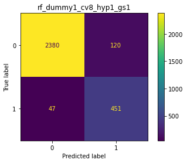
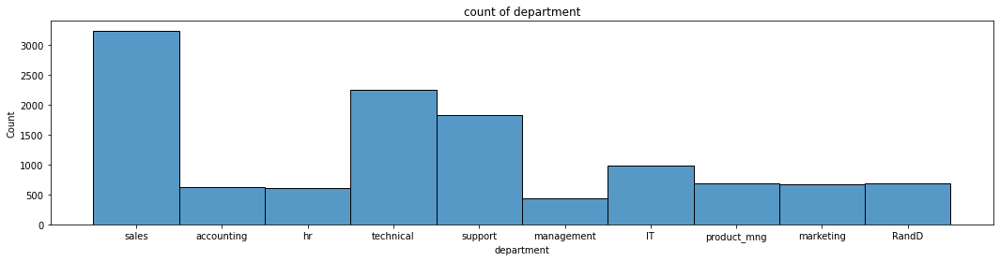
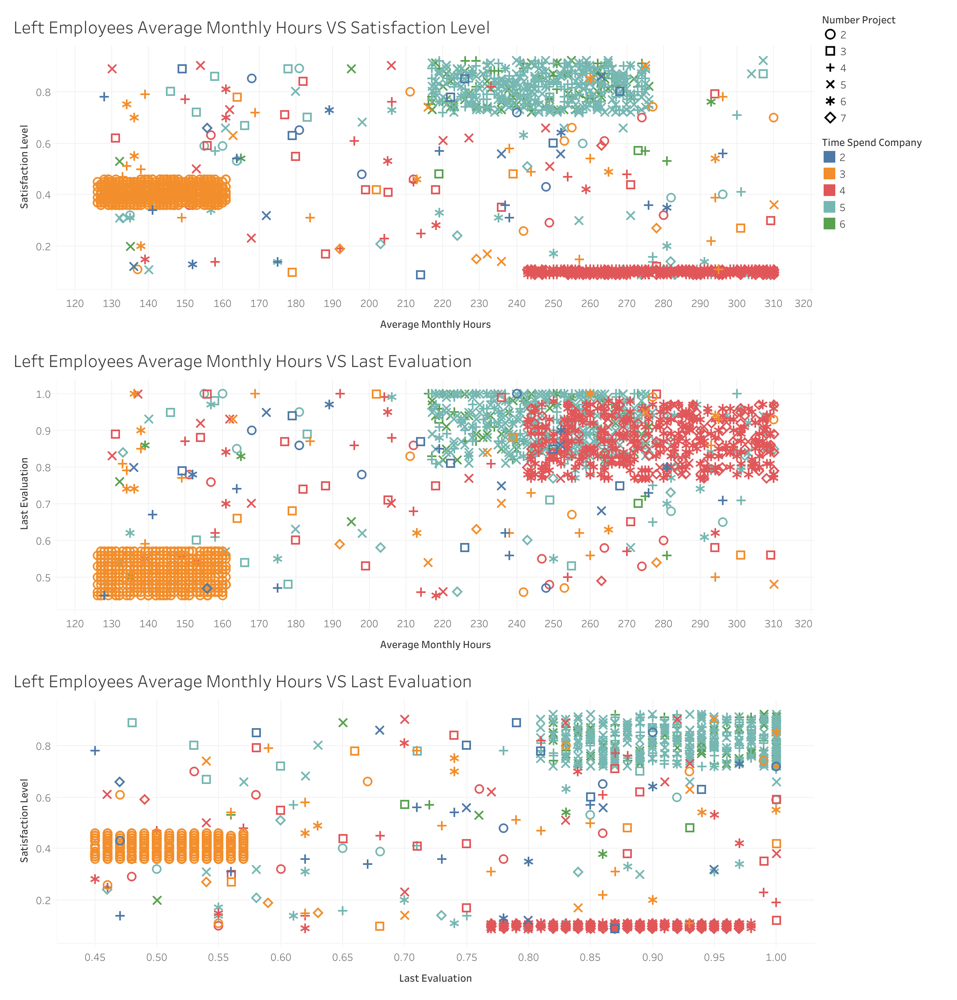

# Terms of Use

This portfolio showcases my skills in data analysis, machine learning, and related areas. 
Each project contains Jupyter Notebooks with code, explanations, and documentation of my thought process.

**Code License:** The code within these Jupyter Notebooks is licensed under the [MIT License](./LICENSE) for the purpose of evaluation by potential employers.

**Non-Code Content License:** The ideas, documentation, and explanations within these Jupyter Notebooks are licensed under the Creative Commons Attribution-NonCommercial-NoDerivatives 4.0 International License (CC BY-NC-ND 4.0).  You can view the license details here: [https://creativecommons.org/licenses/by-nc-nd/4.0/](https://creativecommons.org/licenses/by-nc-nd/4.0/)

**Purpose:** These projects are solely intended for demonstrating my skills to potential employers during my job search.

**Commercial Use and Distribution:** Commercial use or distribution of these projects (beyond evaluation for hiring purposes) is strictly prohibited without my explicit permission.

For any inquiries, please contact me at liucheng.july@outlook.com.

#  Employee retention prediction
* Decision Tree
* Random Forest
* XGBoost

## Documentation Structure
| Directory/File         | Description                                               |
|------------------------|-----------------------------------------------------------|
| `README.md`             | High-level introduction, project purpose, getting started, and documentation structure overview. |
| `LICENSE`                | Code License for the code within these Jupyter Notebooks for purpose of evaluation by potential employers. |
| `LICENSE-NON-CODE`       | License for the ideas, documentation, and explanations within these Jupyter Notebooks  |
| `code/`                 | Jupyter Notebooks of my data projects |
| `code/salifort-motors-employee-leave-prediction-eda.ipynb`                 | Jupyter Notebook of EDA |
| `code/salifort-motors-employee-leave-prediction.ipynb`                 | Jupyter Notebook of classification model, predict employee leave or not |
| `code/salifort-motors-employee-personal-leave-prediction.ipynb`| Jupyter Notebook of classification model, predict employee leave or not(Assume employees who didn't belong to the three groups were employees who choose to quit their job) |
| `code/salifortmotors-employee-satisfaction-prediction.ipynb`                 | Jupyter Notebook of regression model, predict employee satisfaction |
| `image/`             | images of my data projects                        |
| `data/`             | data set of my data projects                        |
| `data/HR_capstone_dataset.csv` | employee data                        |
| `pickle/`             | pickle files of my data projects                        |
| `pickle/left.zip`      | pickle files of `salifort-motors-employee-leave-prediction.ipynb`   |
| `pickle/personal_left.zip`  | pickle files of `salifort-motors-employee-personal-leave-prediction.ipynb`      |
| `pickle/satisfaction.zip` | pickle files of `salifortmotors-employee-satisfaction-prediction.ipynb`  |

## Background
This is my capstone project from Google Advanced Data Analytics Certificate by Coursera. 
A fictional French-based alternative energy vehicle manufacturer. Its global workforce of over 100,000 employees research, design, construct, validate, and distribute electric, solar, algae, and hydrogen-based vehicles. There is a high rate of turnover among Salifort employees. (Note: In this context, turnover data includes both employees who choose to quit their job and employees who are let go). The senior leadership team wants to analyze employee survey data to come up with ideas for how to increase employee retention.

## Goal

* Build Machine learning models to predict employee departure
* Analyze the key factors driving employee turnover
* Come up with ideas for how to increase employee retention

## Data
* HR_capstone_dataset.csv: It represents 10 columns of self-reported information from employees of a fictitious multinational vehicle manufacturing corporation(dataset from Google Advanced Data Analytics Certificate by Coursera). The dataset can be found on 
[Kaggle](https://www.kaggle.com/datasets/mfaisalqureshi/hr-analytics-and-job-prediction). It has been repurposed for this project.

**HR_capstone_dataset**
| Column Name           | Type | Description |
| :---                  | :--- | :--- |
| satisfaction_level    | float64 | The employee’s self-reported satisfaction level [0-1] |
| last_evaluation       | float64 | Score of employee's last performance review [0–1] |
| number_project        | int64 | Number of projects employee contributes to |
| average_monthly_hours | int64 | Average number of hours employee worked per month |
| time_spend_company    | int64 | How long the employee has been with the company (years) |
| work_accident         | int64 | Whether or not the employee experienced an accident while at work |
| left                  | int64 | Whether or not the employee left the company |
| promotion_last_5years | int64 | Whether or not the employee was promoted in the last 5 years |
| department            | str   | The employee's department |
| salary                | str   | The employee's salary (low, medium, or high) |

### Detail
* Familiarize with variables
* Identify potential dependent and independent variables
    * potential dependent variables
        * left: limitation is it includes both employees who choose to quit their job and employees who are let go
        * satisfaction_level: limitation is in some case employees will leave even they are satisfacied, in some case employees will not leave even they are very dissatisfacied, some groups may prefer to give extreme scores.
* Check data(e.g. missing value, duplicates, data range,etc)
* Perform EDA(Exploratory data analysis)
* Perform Hypothesis test
* Build models

* Evaluate champion model on test set

### Summary

**Challenges/Problems**
* Some typical departments like Manufacturing, Packaging, Qulity control, Supply Chain and Logistics are not in this dataset, this dataset may not be representative

* Clear patterns appeared in this dataset. It might indicate data fraud or not randomly sampled data or not independent data(e.g. share survey results with other employees).

* Lack of data. Could not distinguish employees who quit their job from employees company let them go

**model results**
* When predict employees who will leave include quit and company let them go, average_monthly_hours, time_spend_company and last_evaluation were very important factors.
    * Jupyter notebook: `salifort-motors-employee-leave-prediction-models.ipynb`
    * Champion model is `rf_dummy1_cv8_hyp1_gs1`, use `last_evaluation`, `average_monthly_hours`, `time_spend_company`, `promotion_last_5years`, `salary`.
    * On test dataset, amoung employees who are predicted to leave, 78.9% of them are actually left, amoung employees who are actually left, 90% of them are predicted to leave.
    * Champion model score
    
|Score	|precision	|recall	    |F1	        |accuracy	|ROC_AUC |
|:-     |:-         |:-         |:-         |:-         |:-      |
|Train  |0.825675	|0.948074	|0.882651	|0.958160	|0.989949|
|Val    |0.811321	|0.862876	|0.836305	|0.943858	|0.947352|
|Test	|0.789474	|0.903614	|0.842697	|0.943963	|0.953627|

* When predict employees who will quit (Assume employees who didn't belong to the three groups were employees who choose to quit their job), time_spend_company, average_monthly_hours, salary and last_evaluation were very important factors
    * Jupyter notebook: `salifort-motors-employee-personal-leave-prediction.ipynb`
    * Champion model is `xgb_label2_cv10_hyp2_gs3`, use `last_evaluation`, `average_monthly_hours`, `time_spend_company`, `promotion_last_5years`, `salary`
    * On test dataset, amoung employees who are predicted to leave, 9.3% of them are actually left, amoung employees who are actually left, 22.9% of them are predicted to leave. The performance of this model is not good, not recommend to use.
    * Champion model score

|Score	|precision	|recall	    |F1	        |accuracy	|ROC_AUC |
|:-     |:-         |:-         |:-         |:-         |:-      |
|Train  |0.228916	|0.500000	|0.314050	|0.965388	|0.934529|
|Val    |0.102941	|0.241379	|0.144330	|0.953863	|0.727508|
|Test	|0.09322	|0.229167	|0.13253	|0.951968	|0.657758|

* When predict employee satisfaction level, number_project, average_monthly_hours, time_spend_company,  last_evaluation and time_spend_company were very important factors.
    * Jupyter notebook: `salifortmotors-employee-satisfaction-prediction.ipynb`
    * Champion model is `rf_label3_cv10_hyp1_gs1`, use `last_evaluation`, `average_monthly_hours`, `time_spend_company`, `promotion_last_5years`, `salary`
    * On test dataset, 27% of satisfaction level could be explained by this model, mean squared error is 0.04.
    * Champion model score 

|Score	|R-squared	|Adjusted R-squared	|MSE	    |MAE        |AIC|BIC|
|:-     |:-         |:-         |:-         |:-         |:- |:- |
|Train  |0.401014	|0.400681|0.035196	|0.149014   |-3651.452896|-3617.047883|
|Val    |0.318733	|0.317214|0.038174	|0.155170   |-759.492748|-732.017817|
|Test	|0.272423	|0.27145|0.042053	|0.160774   |-982.161804|-952.1333|

**Conclusion**
* Based on the dataset, `average_monthly_hours`, `time_spend_company` and `last_evaluation` are associated with employee satisfaction. 
* Benifit: This model could help us know who will leave and take measures to prevent them from leaving
* Limitation: This model could predict employees who will leave for personal and **company** reason. If our company has different evaluation, worktime, promotion policy or the policy change a lot, the result may not be robust.
* Employees left company had higher average_monthly_hours than employees who didn't, it might indicate overtime work, poor work life balance would make employees quit their job
* Employees left company had higher last_evaluation than employees who didn't, it might indicate no opportunity for growth or development, not satisfacied salary or other reasons
* Left ratio of employees who worked for 2-5 years tend to increase as time_spend_company increase, it might associated with carrer path/skill development
* Recommendations & Next step:
    * Confirm population information(e.g. total regions, departments, time in company, etc) with HR(In real projects it would be performed in an earlier stage)
    * Confirm survey collection process and survey data manipulation process with HR(In real projects it would be performed in an earlier stage)
    * If this dataset is not representative or independent, take a representative random independent sample and collect more data(e.g. Employment type, region, type of left, etc) to analyze.
    * If this dataset is representative and random independent samples:
        * Collect/Monitor employees' work hours to see if it has any patterns. (e.g. almost equal work hour every month, certain month/season were high, change a lot no pattern)
        * Conduct Exit interviews to further analyze
        * Conduct one on one meeting to understand their concerns, what they want to improve ,etc and give them necessary help/support
        * Conduct a satisfaction survey regularly to further analyze which factors make them dissatisfied (e.g. workload, environment, relationships, etc)
        * Consider providing education/training programs to employees
        * Consider providing job redesign program or job rotation program to help employees to develop career
        * Consider introducing Dual career ladders to build different promotion paths for different employees

